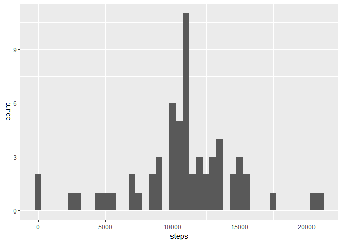

# Reproducible Research: Peer Assessment 1
Steven Chen  
March 16th, 2017  


## Loading and preprocessing the data

We assume that the activity csv has been unzipped and is in R's current working
directory, and now load in the data:


```r
activity <- read.csv("activity.csv", colClasses = c("integer", "Date", "integer"))
dim(activity)
```

```
## [1] 17568     3
```

```r
sapply(activity, function(x) {sum(is.na(x))})
```

```
##    steps     date interval 
##     2304        0        0
```


## What is mean total number of steps taken per day?

To answer this question, we first make a histogram of the total number of steps
taken each day, ignoring missing values:


```r
library(ggplot2)
activityClean <- na.omit(activity)
stepsEachDay <- tapply(activityClean$steps, activityClean$date, sum)
qplot(steps, data = data.frame(steps = stepsEachDay), geom = "histogram", binwidth = 500)
```

<!-- -->

```r
mean(stepsEachDay)
```

```
## [1] 10766.19
```

```r
median(stepsEachDay)
```

```
## [1] 10765
```

As seen, the steps per day follow a somewhat clustered, normalized pattern, with
a mean and median around 10,765 steps per day.


## What is the average daily activity pattern?

Now, we want to visualize the average daily activity pattern, to see when people
are most and least active.


```r
avgPerInterval <- tapply(activityClean$steps, activityClean$interval, mean)
qplot(interval, steps, data = data.frame(steps = avgPerInterval, interval = unique(activity$interval)), geom = "line")
```

<!-- -->

To determine which 5-minute interval contains the max number of steps, averaged over
all days, we simply take the max of our calculations:


```r
names(which.max(avgPerInterval))
```

```
## [1] "835"
```

```r
max(avgPerInterval)
```

```
## [1] 206.1698
```

## Imputing missing values

We repeat our missing values calculation from the first section of the report.
Then, we replace the missing step values with the average interval weight:


```r
sapply(activity, function(x) {sum(is.na(x))})
```

```
##    steps     date interval 
##     2304        0        0
```

```r
# fill in missing values with the date sums computed before
naLogical <- is.na(activity$steps)
uniqueInterval <- unique(activity$interval)
intervalNames <- activity$interval[naLogical]
intervalIndices <- match(intervalNames, uniqueInterval)
newActivity <- activity
# replace NA value with the average steps per interval on that day
newActivity$steps[naLogical] <- avgPerInterval[intervalIndices]
sapply(newActivity, function(x) {sum(is.na(x))})
```

```
##    steps     date interval 
##        0        0        0
```


```r
newStepsEachDay <- tapply(newActivity$steps, newActivity$date, sum)
qplot(steps, data = data.frame(steps = newStepsEachDay), geom = "histogram", binwidth = 500)
```

<!-- -->

Now, to observe some of the changes made by imputing values, we report the new
mean and median total number of steps taken per day:


```r
mean(newStepsEachDay)
```

```
## [1] 10766.19
```

```r
median(newStepsEachDay)
```

```
## [1] 10766.19
```

```r
mean(stepsEachDay) - mean(newStepsEachDay)
```

```
## [1] 0
```

```r
median(stepsEachDay) - median(newStepsEachDay)
```

```
## [1] -1.188679
```

As we have observed, the mean and median are almost unchanged.


## Are there differences in activity patterns between weekdays and weekends?

Here, we look at differences in the average step time series between weekdays
and weekends:


```r
days <- weekdays(newActivity$date)
isWeekend <- (days == "Saturday") | (days == "Sunday")
isWeekend <- as.factor(isWeekend)
levels(isWeekend) <- c("weekday", "weekend")

weekdayActivity <- newActivity[isWeekend == "weekday", ]
weekdaySeries <- tapply(weekdayActivity$steps, weekdayActivity$interval, mean)

weekendActivity <- newActivity[isWeekend == "weekend", ]
weekendSeries <- tapply(weekendActivity$steps, weekendActivity$interval, mean)

df <- data.frame(steps = c(weekdaySeries, weekendSeries), interval = rep(unique(newActivity$interval), 2), isWeekend = as.factor(rep(c("weekday", "weekend"), each = 288)))

qplot(interval, steps, data = df, geom = "line") + facet_grid(isWeekend ~ .)
```

<!-- -->

The plot shows that people walk fewer steps on weekends than on weekdays,
although the time series show correlation in active periods and rest periods.
